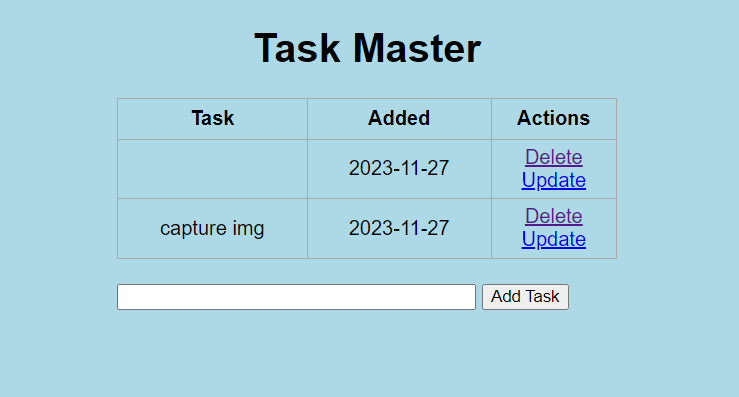

### ToDoListApp

> [Description](#description) | [How To Run](#How_To_Run) | [Screenshot Demo](#screenshot) | [Features](#Features)

## Description:
> To Do List made by Flask 
> This repo has been updated to work with Python v3.8 and up.

### Run development server and open http://localhost:5000

## How To Run
1. Install `virtualenv`:
```bash
pip install virtualenv
```
2. Open a terminal in the project root directory and run:
```bash
virtualenv env
```
3. Then run the command:
```bash
.\env\Scripts\activate
```
4. Then install the dependencies:
```bash
pip install -r requirements.txt
```
5. Finally start the web server:
```bash
python app.py
```
- This server will start on port 5000 by default. You can change this in `app.py` by changing the following line to this:

```python
if __name__ == "__main__":
    app.run(debug=True, port=<desired port>)
```

## Screenshot:


## Features

